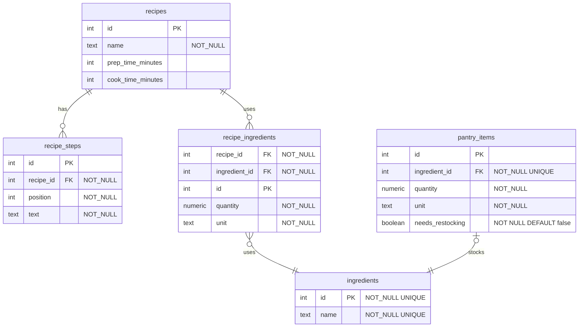

```mermaid
erDiagram
    recipes {
        int id PK
        text name "NOT_NULL"
        int prep_time_minutes
        int cook_time_minutes
    }
    recipe_steps {
        int id PK
        int recipe_id FK "NOT_NULL"
        int position "NOT_NULL"
        text text "NOT_NULL"
    }
    pantry_items {
        int id PK
        int ingredient_id FK "NOT_NULL UNIQUE"
        numeric quantity "NOT_NULL"
        text unit "NOT_NULL"
        boolean needs_restocking "NOT NULL DEFAULT false"
    }
    ingredients {
        int id PK "NOT_NULL UNIQUE"
        text name "NOT_NULL UNIQUE"
    }
    recipe_ingredients {
        int recipe_id FK "NOT_NULL"
        int ingredient_id FK "NOT_NULL"
        int id PK
        numeric quantity "NOT_NULL"
        text unit "NOT_NULL"
    }
    %% recipe_ingredients: UNIQUE (recipe_id, ingredient_id)
    recipes ||--o{ recipe_steps : "has"
    recipes     ||--o{ recipe_ingredients : "uses"
    recipe_ingredients }o--|| ingredients : "uses"
    pantry_items |o--|| ingredients : "stocks"
```
